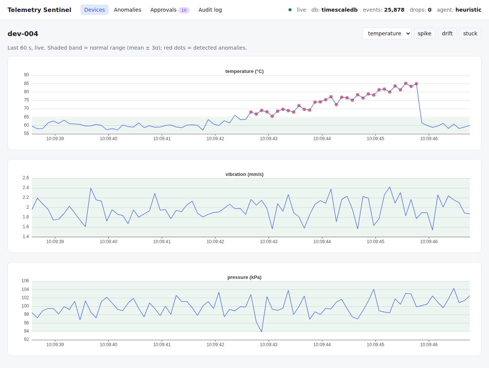
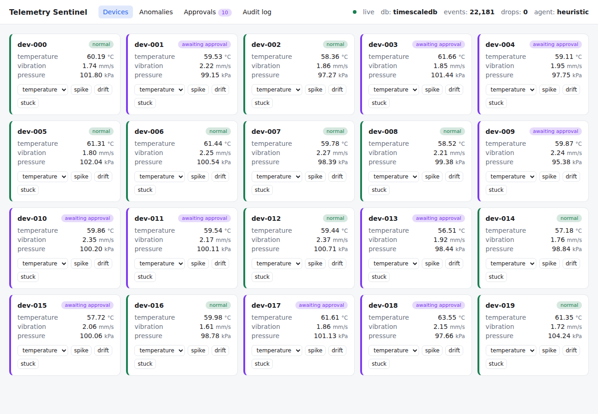
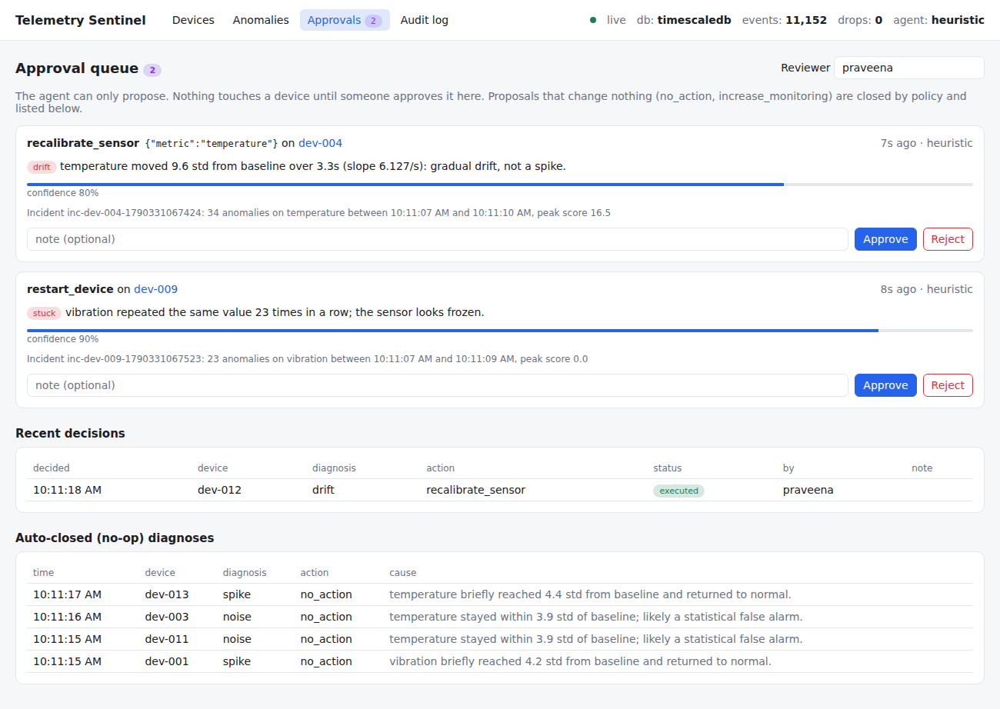
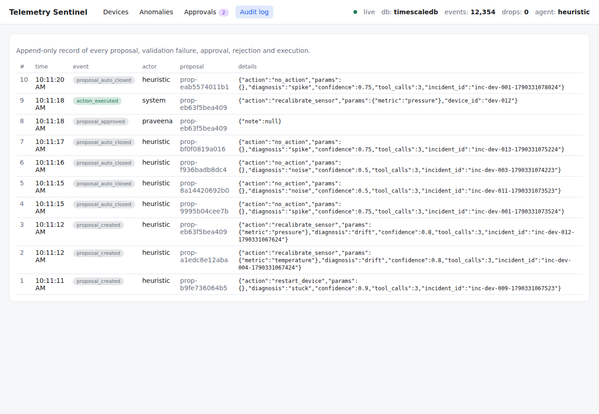
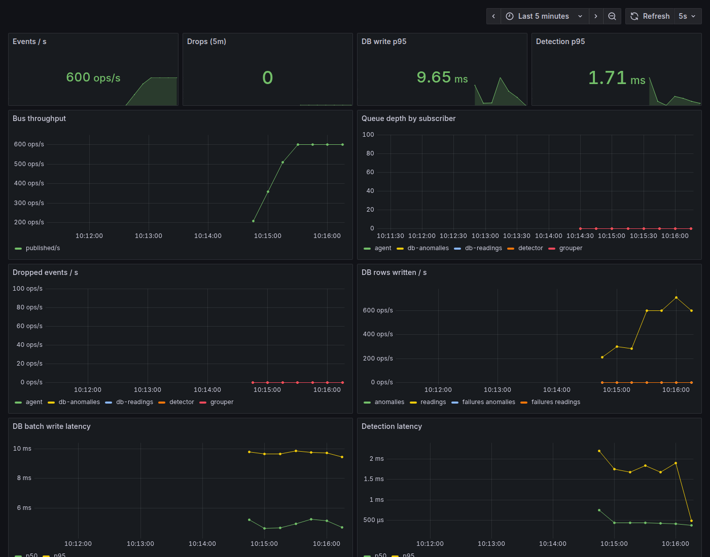

# Telemetry Sentinel

A real-time telemetry platform with an AI incident agent. Simulated industrial devices stream readings
through a typed asyncio event bus into streaming anomaly detection. Readings land in TimescaleDB and stream
live to a React dashboard. Anomalies are grouped into incidents, and an LLM agent investigates them with
read-only tools and proposes a fix. **Nothing runs until a human approves it.**



## Architecture

```
                       ┌──────────────────────────── asyncio EventBus ─────────────────────────────┐
 Simulated fleet ────► │  per-subscriber bounded queues · drop-oldest backpressure · type routing   │
 (spike/drift/stuck    └──┬──────────────┬─────────────────┬─────────────────┬───────────────────────┘
  faults, labelled)       │              │                 │                 │
                          ▼              ▼                 ▼                 ▼
                     Detector      Batched writer     Incident grouper   WebSocket fan-out
                  (z / EWMA /      (COPY, 500 rows    (per device,       (one bounded sub
                   CUSUM / hybrid)  or 200 ms)         quiet 5 s)         per browser)
                          │              │                 │                 │
                     Anomaly ───────────►│                 ▼                 ▼
                                         ▼            Incident agent     React dashboard ◄── human approves
                                   TimescaleDB ◄──── (heuristic or        (devices, charts,       │
                                   hypertables,       Gemini tool loop)    anomalies, approvals,  │
                                   1-min rollups,     guardrails ──►       audit log)             ▼
                                   7-day retention    pending proposal ─────────────────► executor ─► device
                                         ▲                                                   │
                                   FastAPI REST ◄── MCP server (same tools, propose-only)    └─► audit log
                                         │
                                   /metrics ──► Prometheus (alert rules) ──► Grafana
```

## Quick start

```bash
docker compose up --build
```

| URL | What |
|---|---|
| http://localhost:8000 | Dashboard + API (`/docs` for OpenAPI) |
| http://localhost:9090/alerts | Prometheus alert rules |
| http://localhost:3000 | Grafana pipeline-health dashboard |

Demo: open a device, click **drift**. Within about a second the chart shows red anomaly markers. Once the
fault ends, an incident closes and a `recalibrate_sensor` proposal appears under **Approvals**. Approve
it, and the entry appears in the **Audit log**. To see alerting, run `docker compose stop db`. About 20 s
later Prometheus fires `DatabaseWritesFailing`, and the writer buffers rows in memory. Run
`docker compose start db` and the buffer drains with no loss.

To use the LLM agent instead of the built-in heuristic, put `GEMINI_API_KEY=...` in `.env` (see
`.env.example`).

### Local development (no Docker)

```bash
python -m venv .venv && source .venv/bin/activate        # Windows: .venv\Scripts\activate
pip install -r requirements-dev.txt
pytest                                                   # DB tests skip unless TEST_DATABASE_URL is set
uvicorn app.api.server:app --reload                      # in-memory store unless DATABASE_URL is set
cd dashboard && npm install && npm run dev               # http://localhost:5173 (proxies to :8000)
```

## Design decisions

**Event bus** (`app/bus.py`)
- Each subscriber has its own bounded queue, so a slow consumer (a browser tab, a database outage) never
  blocks the publisher or the other consumers.
- **Drop-oldest** when a queue is full: for live telemetry, fresh data is worth more than stale data.
  Every drop is counted and exported, so loss is visible and alertable, never silent.
- Events are routed by type (`isinstance`). WebSocket clients subscribe and unsubscribe at runtime.

**Detection** (`app/detectors.py`)
- One detector per (device, metric). Flagged readings never update the baseline.
- The z-score is excellent on spikes but misses early drift: the slow change leaks into its window.
  CUSUM accumulates small persistent deviations, so it catches drift, but a lone spike also trips it.
- The **hybrid** detector (default) combines a point z-test for spikes, CUSUM on *clipped* residuals
  for drift (clipping stops a single spike from tripping CUSUM), and a flatline test for frozen sensors.

**Storage** (`app/storage/`)
- Uses `copy_records_to_table`, flushing at 500 rows or 200 ms, whichever comes first.
- If the database is down, the writer retries with exponential backoff behind a bounded buffer that also
  drops oldest (counted). Meanwhile the bus subscription absorbs bursts.
- Readings go in a TimescaleDB hypertable, with a one-minute continuous aggregate and 7-day retention.
  On plain Postgres (for dev or CI without the extension), the same schema falls back to a view.
- Proposal state changes are a single conditional `UPDATE`, so two reviewers can't both decide one proposal.

**Incident agent** (`app/incidents.py`, `app/agent/`)
- **Grouping first.** Anomalies on one device merge into one incident, closed after 5 s of quiet or
  capped at 60 s, so the agent sees one problem instead of fifty alerts.
- **Read-only tools** return compact summaries (mean, std, slope, longest flat run, about 40 sampled
  points) instead of raw rows, which is cheaper and easier for the model to reason over. Ground-truth labels
  are stripped.
- **Context pre-loading.** The agent gathers the incident and the before/during summaries itself and sends
  them in the first message, so the model usually answers in **one request** instead of about four (it can
  still call tools if it needs more). A free-tier key allows only about 20 requests a day for the model, so
  this is the difference between about 4 and about 20 diagnosed incidents a day, and it cuts latency too.
  `--no-preload` runs the original tool-by-tool loop for comparison.
- **Guardrails:**
  - strict schema (pydantic, `extra="forbid"`)
  - action allowlist with exact parameters
  - the proposal must reference its own incident and metrics
  - the Gemini loop gets validation errors back and may correct itself, with bounded retries
  - re-validation before storing *and* before executing
  - a per-minute LLM budget, and at most one pending proposal per device
- **Human approval** is the only path to execution. Actions that change nothing (`no_action`,
  `increase_monitoring`) are recorded as `auto_closed` so they don't bury real decisions.
- **Audit log:** every proposal, validation failure, skip, approval, rejection and execution.
- **MCP server** (`python -m app.agent.mcp_server`): the same tools for any MCP client. It can propose
  but deliberately has no approve or execute tool.

## Results

Two machines:
- **Laptop:** Windows, 12 CPU threads, Python 3.14.5, in-memory store.
- **Sandbox:** Linux cloud VM, 4 vCPU, Python 3.11, TimescaleDB 2.30 in Docker on the same host.

Detection quality is deterministic: the simulator is seeded, so precision and recall come out the
same on every machine. Latency and capacity depend on the hardware. See
[docs/ROADMAP.md](docs/ROADMAP.md) for the database measurements still to take on the laptop.

**Detector comparison.** Command: `python -m app.compare --markdown`. Setup: 20 devices × 3,000 readings
per metric, seed 7, benchmark fault rates. `episodes` = fraction of injected faults flagged at least once;
`drift_delay` = median readings from drift start to first flag.

| detector | precision | false alarms / 10k | spike recall | drift recall | drift episodes | stuck episodes | drift delay |
|---|---|---|---|---|---|---|---|
| zscore | 0.993 | 1.9 | 0.959 | 0.601 | 0.941 | 0.0 | 9 |
| ewma | 0.977 | 1.8 | 0.870 | 0.110 | 0.494 | 0.0 | 8 |
| cusum | 0.960 | 15.5 | 0.891 | 0.817 | 0.994 | 0.146 | 7 |
| **hybrid** | 0.988 | 5.9 | **0.976** | **0.815** | **0.994** | **1.0** | 7 |

EWMA does worst on drift. Its variance estimate absorbs the early drift, which widens the threshold
before the drift is large enough to cross it.

**Pipeline**

| measurement | result | machine | command |
|---|---|---|---|
| Live run, 20 devices × 10 Hz × 3 metrics | 615 events/s, precision 0.98, recall 0.74, 0 drops | both | `python -m app.main --seconds 30` |
| Detection latency (reading → anomaly) | p50 0.29 ms, p95 0.90 ms | laptop | same |
| Sustainable capacity, detector only | **85.9k events/s**, 0 drops (2,868 devices, one Python process) | laptop | `python -m app.loadtest` |
| Sustainable capacity, detector only | 38.5k events/s, 0 drops (1,275 devices) | sandbox | same |
| Sustainable capacity, detector + TimescaleDB writes | 23.0k events/s, 0 drops (757 devices) | sandbox | `python -m app.loadtest --dsn ...` |
| Raw batched write throughput | 43.5k rows/s, flush p50 9.2 ms / p95 17.4 ms | sandbox | `python -m app.bench_writer --dsn ...` |
| WebSocket fan-out, 10 browsers | 613 events/s each, p95 lag 17 ms, 0 drops | sandbox | `python -m app.ws_bench` |
| DB outage (stop TimescaleDB) | alert fires in ~20 s; ~12k rows buffered, 0 lost on recovery | sandbox | `docker compose stop db` |

Past 86k events/s the laptop run stops keeping up: at a 129k/s target it managed 98.8k/s, detector
lag rose to 170 ms and nothing was dropped. The limit is one CPU core, since the whole asyncio
pipeline runs on a single thread. Going further means running several processes, each handling a
share of the devices.

**Incident agent eval.** Command: `python -m app.agent.eval run`. Data: 247 recorded incidents with ground
truth (158 spike, 59 drift, 24 stuck, 6 false alarms; 41 contain more than one fault).

| agent | diagnosis accuracy | any-label accuracy | correct action | invalid proposals | mean time |
|---|---|---|---|---|---|
| heuristic baseline | 0.935 | 0.976 | 0.968 | 0 | 0.4 ms |
| Gemini | *run with your key* | | | | |

## Project layout

```
app/
  bus.py  events.py  simulator.py  detectors.py  detector.py  incidents.py  runtime.py
  storage/   base.py (Store, MemoryStore)  postgres.py  writer.py  schema.sql
  agent/     tools.py  guardrails.py  diagnosers.py  agent.py  actions.py  mcp_server.py  eval.py
  api/       server.py (REST, /ws, /metrics, serves the dashboard)
  main.py  compare.py  loadtest.py  bench_writer.py  ws_bench.py    # benchmarks
dashboard/   React + TypeScript + ECharts (Vite)
deploy/      Prometheus config + alert rules, Grafana provisioning + dashboard
evals/       recorded incidents for the agent eval
tests/       59 tests: unit, API, WebSocket, agent, guardrails, TimescaleDB integration
```

## Screenshots

| Devices | Approvals |
|---|---|
|  |  |
| **Audit log** | **Grafana** |
|  |  |
